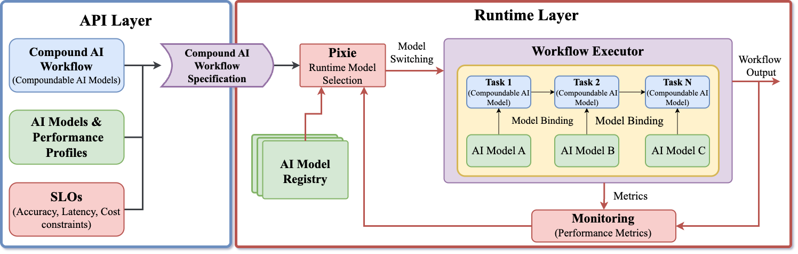

# PLAIgroud

PLAIground is a novel framework designed to enable runtime model selection in Compound AI Systems. It decouples high-level algorithmic design from low-level execution concerns, enabling developers to define workflows as directed graphs of task-oriented components rather than focusing on integration details. By separating the "what" from the "how", PLAIground ensures workflow portability across 3D Compute Continuum, from satellites, through edge devices to cloud clusters. To support declarative execution PLAIground employs model selection mechanism to allocate optimal models for each task, based on SLO constraints. 



This is the source code repository for the PLAIground prototype implemented in Python and described in the paper: **PLAIground: A Framework for Runtime Model Selections for Compound AI Systems in the 3D Continuum**. Details on the architecture, mechanisms, and evaluation can be found in the paper.

## Core Concepts 

### Compoundable Model 

The key abstraction of PLAIground is the **Compoundable Model**—a computational unit that wraps an AI task and separates the high-level task specification (what needs to be done) from low-level execution details (which models perform the task, deployment, etc.).


It encapsulates three contracts that define its behavior and interface:

- **Data Contract** - defines the input and output data structures required by the model to ensure type safety and seamless integration. By enforcing strict schemas (e.g., requiring an `image` byte stream input or a `bounding_box` list output) and validating data at runtime, it prevents integration errors when connecting heterogeneous models in a workflow.
- **Task Contract** - provides a declarative specification of the computational intent, independent of any specific model implementation. By defining the required capability (e.g., `llm` or `object_detection`) and task configuration (such as prompt templates or classification labels) rather than hardcoding a provider, it enables complete workflow portability. This separation allows the system to swap underlying models—like replacing GPT-4 with a local Llama instance—without requiring any changes to the workflow code.

##### Example: Specifying a Compoundable Model in PLAIground prototype implementation

```python
from v2.core.decorator import compoundable_model

@compoundable_model(
    capability="llm",  # Task Contract: Capability
    task_config={      # Task Contract: Configuration
        "prompt": "Analyze the sentiment of this text: {text}",
        "temperature": 0.7
    }
)
def analyze_sentiment(data: dict) -> dict:  # Data Contract: Input/Output Schemas
    """A Compoundable Model for sentiment analysis."""
    pass
```

### Model Selection 

Model Selection is a runtime mechanism that automatically determines which underlying implementation should fulfill a specific Task Contract.

## Workflows 

Workflows in PLAIground are implemented as directed graphs of Compoundable Models. They define the orchestration logic and data flow between tasks.

##### Example Workflow Implementation

```python
from v2.workflow import DeclarativeWorkflow, selector
from v2.selector import AdaptiveSelector, SLOConstraints

@selector(
    AdaptiveSelector,
    slo=SLOConstraints(min_accuracy=0.85, max_p95_latency_ms=3000)
)
class WildfireDetectionWorkflow(DeclarativeWorkflow):

    # Define tasks
    @compoundable_model(capability="object_detection")
    def detect_fire(self, data): pass

    @compoundable_model(capability="llm", task_config={"prompt": "Report: {data}"})
    def generate_report(self, data): pass

    # Define execution graph
    def run(self, image_path):
        detection = self.detect_fire({"image": image_path})
        
        if detection.get("has_detection"):
            return self.generate_report({"data": detection})
        return {"status": "clear"}
  ```

## Setup 

1.  Clone the repository.
2.  Install dependencies:
    ```bash
    pip install -r requirements.txt
    ```
3.  Configure your environment variables in a `.env` file:
    ```bash
    OPENAI_API_KEY=sk-...
    ANTHROPIC_API_KEY=sk-...
    ```
4.  Define your available models in registry `config/implementations.yaml`.

## How to Run

Execute workflows as standard Python modules. The framework will automatically load configuration and initialize the selectors.

```bash
python -m v2.examples.wildfire_workflow


